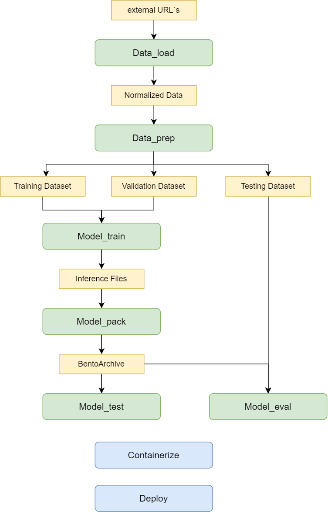

# Binary CV-Pipeline

As part of the Binary CV Pipeline scenario, we use the SinaraML Framework to create a complete model development cycle, starting with preparing data for model training and ending with deploying the trained model in a production environment.      
Binary CV Pipeline contains a set of sequential steps, each responsible for its own functionality:
- data loading (data_load) 
- data preparation (data_prep) 
- training model (model_train) 
- packing model (model_pack) 
- evaluate model (model_eval) 
- testing model (model_test).

Functionality of each of the Binary CV Pipeline step described in more detail below.

Note that the Binary CV Pipeline delivering the train results "as is". After training the model we will use SinaraML to package the trained model and related files into BentoArchive. Where BentoArchive is an archive format that allows you to save the model and all the necessary files as artifacts so that they can be easily transferred and deployed in another environment.
Then we can containerize BentoArchive in Docker Image using SinaraML CLI. This makes it easy to deliver the model to the production environment and then extract the artifacts - inference files of the trained model for subsequent launch of the inference.
It is also worth noting that transferring the model "as is" to the production environment using SinaraML has several advantages:
1. It guarantees the preservation of all parameters and weights of the model.
2. It provides simplicity and convenience in deploying the model, since the entire process is automated and does not require additional actions.    

Also mention that retrain the model (a part of the COCO validation sample) is used which is a subset of the data from the full dataset. This reduces the amount of data and speeds up the learning process. As a result of further training the model will be better adapted to specific tasks and data which will lead to increased accuracy and performance.  

  
  
&nbsp;

  

    <b>High Concept Binary CV-Pipeline</b>
  

  
&nbsp;

# Description of Binary CV-Pipeline steps
## **Data_load**
### Step logic:
Data_Load is a component of the CV Pipeline, which is responsible for uploading data to the SinaraML Storage. It performs two main tasks: uploading external raw data to the platform to convert it into the correct versioned storage structure.
When uploading data, CV Pipeline extracts this data and prepares it for further processing. This includes converting data formats, converting markup.    
This data can be obtained from various sources, such as files, databases, or APIs. After obtaining data it converted to the correct storage structure, taking into account the versioning requirements. This ensures that the data is saved and available for later analysis and use.
In general, CV Pipeline plays an important role in the data processing process, ensuring that it is properly loaded and converted into a versioned analytical storage structure. This allows effective data management and provides a reliable basis for subsequent analysis and use of information.
### Interface:
- **Input**:
Raw data: different sources, different annotations, external sources
- **Output**:
Normalized data: with the correct structure for storage in the repository
_____________________________________________
## **Data_prep**
### Component logic:
At the CV Pipeline Data_Prep step, the data is carefully analyzed and processed to ensure its quality and suitability for future use. This process does the following:
1. Validation: The dataset is checked for errors or inconsistencies. For example, it checks whether there are negative coordinates or omissions in the markup. If such problems are found, they are fixed or deleted.    
2. Markup conversion: If the data markup requires changes or additions, it is converted accordingly. For example, you may need to reclassify objects or add new labels.    
3. Separation of samples: The data set is divided into separate subsets: training, validation and testing datasets. The training set is used to train the model, the validation set is used to set up hyperparameters and evaluate the performance of the model during training, and the test set is used for the final evaluation of the model after training.     
4. Data viewing and processing: Visual data analysis allows you to get an idea of the characteristics of a dataset. For example, class distribution histograms are built to assess class balance and identify possible problems. It may also be useful to consider visual markup examples to better understand the data and possible challenges when training the model.     
### Interface:
- **Input**:
Normalized data (obtained from the previous step CV Pipeline - Data_Load)
- **Output**:
Correct data (data that is suitable for training and testing the trained model)
_____________________________________________
## **Model_train**
### Component logic:
At this step, the model is trained using the training and validation datasets created at the data_prep component step.
To transfer to the following components, weights from the last epoch and the epoch with the best metric are copied. We also copy one of the images of the validation dataset to the directory with the trained model for subsequent tests.    
### Interface:
- **Input**:
Training and validation datasets (obtained from the previous step CV Pipeline - Data_Prep)
Model learning parameters (number of epochs, learning rate, batch size, etc.)
- **Output**:
A model in the Pytorch format (weights from the last epoch of learning and with the best metrics)
_____________________________________________
## **Model_pack**
### Component logic:
The CV Pipeline: model_pack component is responsible for packaging the model that was trained in the Model_train stage into BentoArchive. In this scenario, the trained model is passed on unchanged.    
BentoArchive is an archive format that allows you to package a model and all its dependencies along with metadata and configuration. This makes it easy to transfer and deploy the model to other environments or devices.    
When you pack a model model_pack all files needed to perform inference including model weights, configuration files, and any other dependencies, are added to BentoArchive. This allows the completeness and integrity of the model to be preserved so that it can be used to perform inference in other scenarios or on other platforms.
Thus the CV Pipeline: model_pack component plays an important role in the process of storing and transferring the trained model, ensuring that it is ready to be used "as is" in other environments or on other devices.
### Interface:
- **Input**:
Inference files (obtained from the previous step CV Pipeline - Model_Train)
- **Output**:
BentoArchive
_____________________________________________
## **Model_eval**
### Component logic:
This stage of the CV Pipeline Model_Eval provides testing of the model, evaluating its performance, saving predicates for further analysis, and visualizing the results using metrics and graphs.   
### Interface:
- **Input**:
Test dataset (obtained from the CV Pipeline - Data_Prep step)    
Inference files from BentoArchive (obtained from the previous step CV Pipeline - Model_Pack)    
- **Output**:
Model Quality Report
_____________________________________________
## **Model_test**
At this stage, CV Pipeline Model_Test is testing the packaged BentoArchive, which contains inference files and other necessary artifacts.
It may contain several tests:
1. Comparison of artifacts before and after BentoArchive packaging by hash
2. Comparison of the inference results on the test image through the trained model before and after packaging in BentoArchive

### Interface:
- **Input**:
Inference files from step  CV Pipeline - Model_Train)
Inference files from BentoArchive (obtained from the previous step CV Pipeline - Model_Pack)    
_____________________________________________
## **Containerize and extract Artifacts from model image**
You can get acquainted with the functionality by following the links:     
<a id="blob-path" href="https://github.com/4-DS/sinara-tutorials/wiki/Getting-started-with-SinaraML-CV#model-image-build">Model Image build</a>     
<a id="blob-path" href="https://github.com/4-DS/sinara-tutorials/wiki/Getting-started-with-SinaraML-CV#extract-artifacts-from-model-image">Extract Artifacts from model image</a
